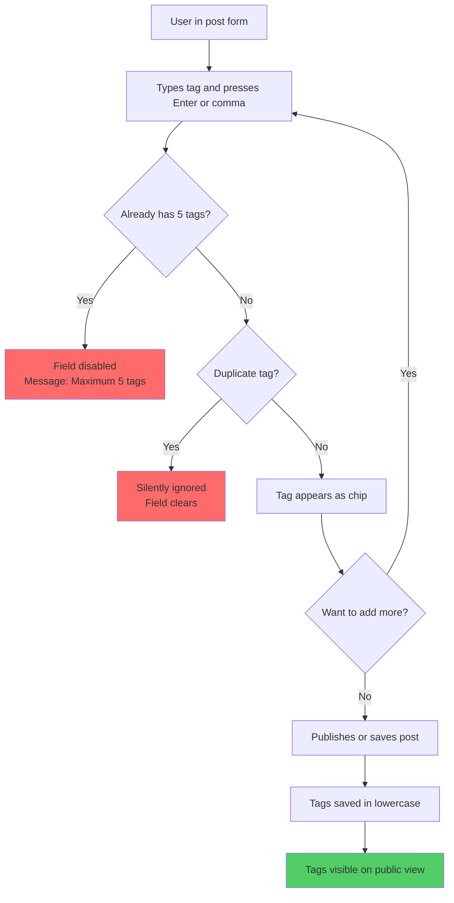
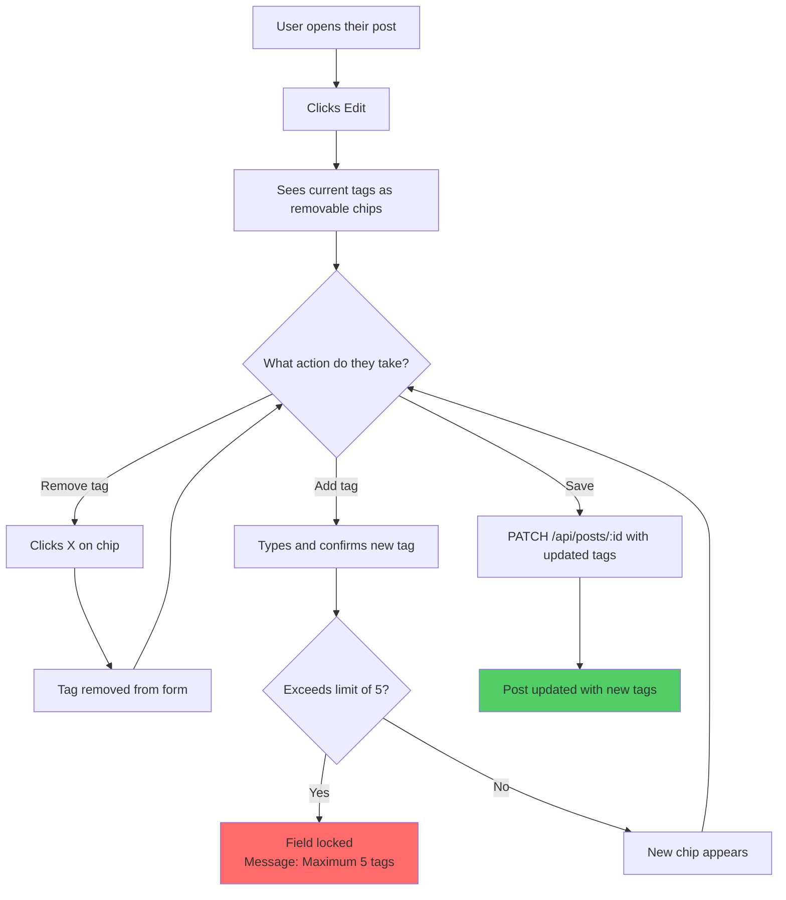

# Flows — Post Tags

---

## Flow 1 — Add tag (happy path + limit)

---

## Flow 2 — Edit tags on existing post

---

**Legend:**
- 🟥 Red (`fill:#ff6b6b`) — error or blocked state
- 🟩 Green (`fill:#51cf66`) — success or end of flow
- ⬜ No color — normal flow steps
