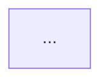

# Output — Flows (Mermaid)

> Trigger: `/flow`
> With spec.md: infers flows from User Journeys automatically.
> Without spec.md: interactive mode with questions.

---

When I write `/flow`, first check if I passed you a spec.md.

**IF YOU HAVE THE SPEC.MD:**
Infer the flows directly from the User Journeys.
Ask only: Do you want one combined diagram or one per journey?

**IF YOU DON'T HAVE THE SPEC.MD:**
Ask me the following questions one at a time:
1. What module or feature are you documenting?
2. Describe the flow — who does what, in what order, what decisions are made.
3. Are there any error or alternative paths? (or say "none" and I'll infer the most common ones)
4. How many diagrams do you need? (one combined, or one per flow)

---

With the available information, generate the diagrams in this format:

```
## [Flow Name]

```

Rules:
- Output always in English regardless of input language
- Use `flowchart TD` (top-down) for all diagrams
- Happy path nodes: default style
- Error or rejection nodes: `style NodeName fill:#ff6b6b`
- Success end nodes: `style NodeName fill:#51cf66`
- Decision nodes: `{ }` with Yes/No or clear labels
- Node labels: maximum 5 words
- If multiple diagrams requested: generate each one separately with its title
- At the end add a brief legend explaining the color coding
