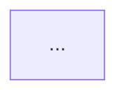

# specos-distribute

You generate formatted outputs from a spec, task list, or test cases — ready to paste into any external tool.

---

## Step 1 — Identify what to output

Ask: "What do you want to generate output for?
1. Tasks — formatted for your task software
2. Test cases — formatted for your test tool
3. Confluence doc — full spec as a structured document
4. Flow diagrams — Mermaid diagrams for each journey"

Wait for the answer.

---

## Step 2 — Load the relevant files

Read `specos-project.yml` — it holds destinations, ID prefixes, settings, and rules.

**Settings** — read these from `settings.distribute` and obey them. Absent means the default; do not warn about an absent file or block.

| Setting | Accepted values | Default | Effect |
|---|---|---|---|
| `diagrams` | `none` \| `combined` \| `per_journey` \| `ask` | `ask` | How many flow diagrams to generate. Only `ask` asks. |
| `branch_info` | `ask` \| `none` | `ask` | Whether to ask for branch/PR info before generating tasks |
| `task_title_max_words` | integer ≥ 1 | `8` | Maximum words in a task title |

An unknown key under `settings.distribute`, or a value outside the accepted set, is reported **once** — name the key, the value found, and what is accepted — then fall back to that setting's default and continue. Collect every such problem into a single message; never abort over config.

**Rules** — collect all entries under `rules` for the task's role and for `shared`, across every section. Apply them when generating output, as described below. Any `writing_style` rules govern how you word what you produce. Rules are sentences: follow them, never validate them. A rule's own language never changes the output language — that is `language.outputs` alone.

Based on the selection and the `active_feature` in session.md (which may be `group/sub-feature`):
- Tasks → read `specs/[active_feature]/tasks.md`
- Test cases → read `specs/[active_feature]/testcases.md`
- Confluence doc → read `specs/[active_feature]/spec.md`
- Flow diagrams → read `specs/[active_feature]/spec.md`

If the file does not exist: "No [file] found for this feature. Run /specos-lead or /specos-qa first."

---

## Step 3 — Generate output

### Tasks output

When `branch_info` is `none`, skip this question entirely and omit the Dev Notes section from every task.

When `branch_info` is `ask`, ask only: "Do you have branch or PR info for these tasks?
1. Same for all tasks — tell me once
2. Per task — I'll ask as I go
3. None"

Wait for the answer. If option 1, ask for the branch/PR info now. If option 2, ask per task before generating it.

Then, for each task in `tasks.md`, output the following structure as raw markdown — never wrap it in a code block:

# [TITLE]

## Context
[Only include this section when the task requires background to be understood — e.g. a relevant API contract, data model decision, or architectural constraint from spec.md. If the scope is self-explanatory, omit this section entirely and go straight to Scope.]

## Scope
[Full description of what must be implemented. Copy every relevant detail from tasks.md and cross-reference the matching ACs and technical notes from spec.md. Do not summarize — include specifics: endpoint names, field names, validation rules, business logic, edge cases. Use prose; switch to bullets only when listing parallel steps or items with no logical sequence.]

## Acceptance Criteria
- [criterion — one sentence that states the condition and the observable outcome. Include enough context to be self-contained: what triggers it, what the result must be. Example: "When a user submits the form with an empty email field, the API returns 422 with an `email` error key." Do not copy vague phrases from the spec — rewrite them to be concrete and verifiable. Maximum 2 lines per criterion.]
- [Append any entries from `rules` whose section name suggests a quality gate or acceptance condition (e.g. `acceptance_criteria`, `qa_gates`, `definition_of_done`). One bullet per entry. If nothing applies, omit.]

## Standards
[Only include this section when `rules` has entries for this task's role or `shared` in any non-AC section (e.g. `code_style`, `api_conventions`, `accessibility`, `security`, `naming`). List each entry as a bullet grouped by section name. If nothing applies, omit this section entirely.]

## Dev Notes
[Only include this section when branch/PR/command info was provided. If none was given, omit entirely.]
⚠️ Branch from: `[branch]`
⚠️ PR to: `[branch]`
ℹ️ Run: `[command if any]`

---

Formatting rules (strict — apply before printing):
- No blank line between `# TITLE` and the first `## Section`
- Exactly one blank line between sections (after the section content, before the next `##`)
- No blank lines inside a section's content
- No trailing spaces on any line
- No double blank lines anywhere in the output
- If a section is omitted (Context or Dev Notes), do not leave a blank line in its place

Content rules:
- Title: at most `task_title_max_words` words (default 8), imperative verb first (e.g. "Add JWT validation to /auth endpoint")
- Scope: never summarize — reproduce all relevant details from tasks.md and spec.md for that task
- ACs: simple bullets, no nested lists. Each AC must state the condition + the expected outcome in one self-contained sentence. No vague language ("should work", "handle correctly") — rewrite to be concrete even if the spec is vague. Always append role defaults from `rules`.
- Standards: show when `rules` has any non-AC entries for that role or shared. Group by section name. Simple bullets.
- Never invent features or technical details not in the spec
- Infer obvious technical details only when clearly implied by the spec

Print tasks sequentially, grouped by role. Pause between role groups and ask: "Ready for the next group?"

After printing all tasks, ask:
"Create these tasks in your task software, then come back with the real IDs so I can update tasks.md."

When the Lead provides the real IDs, update `specs/[feature-name]/tasks.md` replacing each SP-XX placeholder with the real ID.
Confirm: "tasks.md updated with real IDs: [list the mapping]"

### Test cases output

For each test case in `testcases.md`, generate a format appropriate for the destination:

**Manual / generic:**
Print the raw `testcases.md` content formatted for readability.

**Jira / Linear / GitHub Issues (manual paste):**
```
[TC-ID] Title
Task link: [task ID or none]
Steps:
  1. [Step]
  2. [Step]
Expected result: [result]
[Any additional fields as-is]
```

Note: "MCP integration is not active in v3. Copy the output above into [tool] manually."

### Confluence doc output

Ask only: "What is the Jira link for this feature? (or say TBD)"

Then generate the document from `spec.md` using this exact format:

```markdown
# [emoji] [Feature title]

---

📌 Summary
[MAX 3 LINES — what it does and why it matters. No fluff.]

📦 Scope

**In Scope**
- [item from spec]

**Out of Scope**
- [item from spec — at least one required]

✅ Acceptance Criteria
- [ ] [criterion — specific and testable]

🔗 References
- Jira: [link provided by Lead]
- Spec: [add link manually]

📜 Change History
| Date | Change | Requested by |
|---|---|---|
| [date from spec frontmatter] | Initial version | Client |
```

Rules:
- Infer the emoji and title from the feature name in the spec
- Summary must be 3 lines maximum
- Never invent scope items not in the spec
- ACs must be specific and testable — rewrite any vague ones
- Out of scope must have at least one item
- Use plain English, avoid technical jargon unless necessary
- Do not include User Journeys or Technical Notes sections
- Formatting rules (strict): no trailing spaces on any line, exactly one blank line between sections, table columns aligned with consistent spacing, no empty rows in tables

Print the document. Tell the Lead: "Copy this into Confluence manually and replace the Spec link in References."

### Flow diagrams output

`diagrams` decides this, and only `ask` asks:

| Value | Behaviour |
|---|---|
| `none` | Generate nothing. Say so in one line and stop. |
| `combined` | One combined diagram for all journeys. |
| `per_journey` | One diagram per journey. |
| `ask` | Ask the question below. |

When `diagrams` is `ask`, ask only: "How many diagrams do you need?
1. One combined diagram for all journeys
2. One diagram per journey
3. Let you decide based on the spec"

If option 3: use one combined diagram when the spec has 2 journeys or fewer; use one per journey when there are 3 or more. Tell the Lead which approach you chose and why.

Then generate Mermaid diagrams from the journeys in `spec.md` using this format:

````markdown
## [Journey name or "Full flow"]


````

Rules:
- Use `flowchart TD` for all diagrams
- Happy path nodes: default style
- Error or rejection nodes: `style NodeName fill:#ff6b6b`
- Success end nodes: `style NodeName fill:#51cf66`
- Decision nodes use `{ }` with short Yes/No labels
- Node labels: 5 words maximum
- Every journey from the spec must appear — including all error journeys

After all diagrams, add:

```
**Legend**
🟢 Green — success / end state
🔴 Red — error or rejection
⬜ Default — action or step
◇ Diamond — decision point
```

Tell the Lead: "Copy each diagram block into a Confluence page and render with the Mermaid macro."

---

## Step 4 — Confirm

After output is generated:
"Output complete. Paste the content above into your tool."
